# EDA extenso — Detección de fraude con tarjeta de crédito

Dataset: Kaggle "Credit Card Fraud Detection" (Kartik Shenoy), `fraudTrain.csv`.
Tarea: clasificación binaria — `is_fraud` (1 = fraude, 0 = legítimo).

**Cifras base del dataset:**
- 1,296,675 filas × 23 columnas (sin nulos, sin duplicados).
- Fraude: **7,506 transacciones (0.579%)** — desbalance de clases extremo.
- Monto promedio: legítimo $67.67 (mediana $47.28) vs. fraude $531.32 (mediana $396.51).

---

## 1. Desbalance de clases

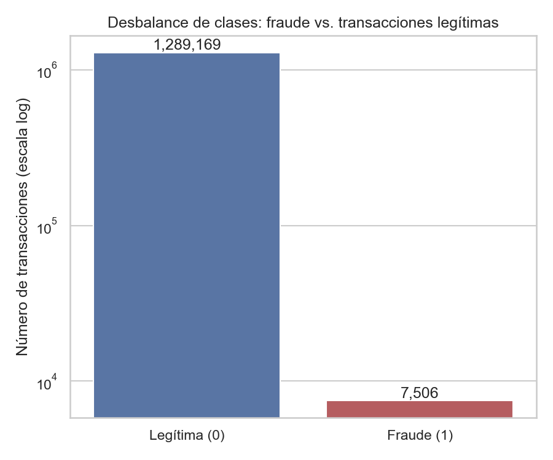

- Fraude es ~0.58% del total — **clase minoritaria extrema**.
- Implicación directa para modelado: la exactitud (*accuracy*) es una métrica engañosa
  aquí; conviene usar PR-AUC, recall, precisión, o ajustar el umbral de decisión, y
  manejar el desbalance vía *class weighting* (más seguro que SMOTE en datos con
  estructura temporal, por riesgo de fuga de información).

## 2. Distribución del monto (`amt`): fraude vs. legítimo

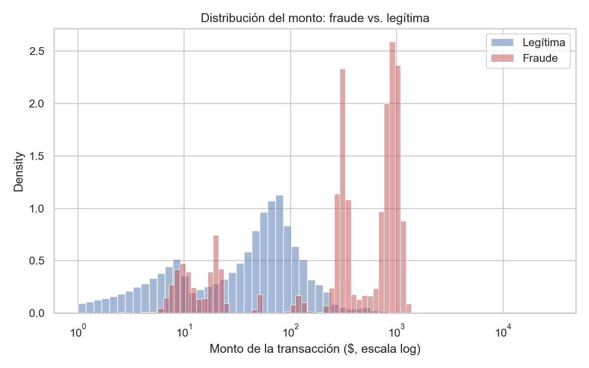

- Fuerte asimetría a la derecha en ambos grupos (de ahí la escala log).
- Las transacciones fraudulentas se concentran en montos **más altos** que las legítimas.
- `amt` es probablemente la variable individual más fuerte para distinguir fraude.

## 3. Distribución por hora del día

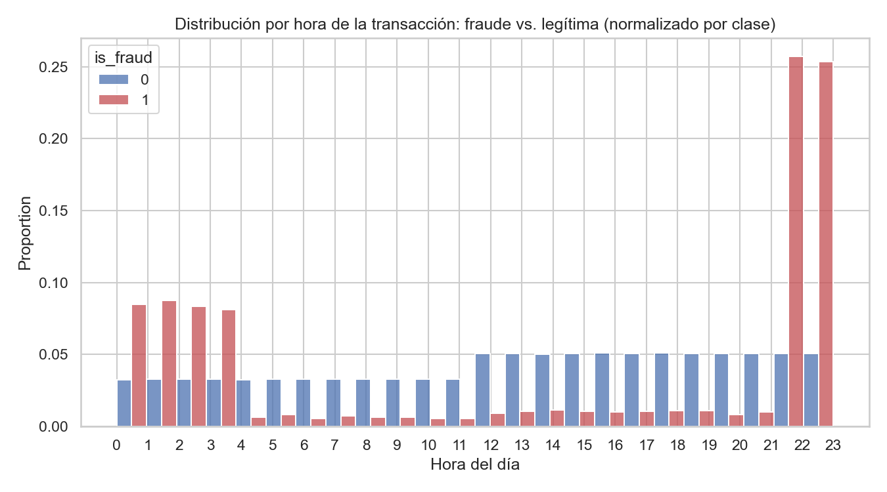

- Las transacciones legítimas siguen un patrón típico de actividad diurna/horario comercial.
- El fraude se concentra notablemente en horas de **madrugada/noche** — patrón muy distinto
  al de las transacciones normales.

## 4. Top 10 categorías de comercio por tasa de fraude

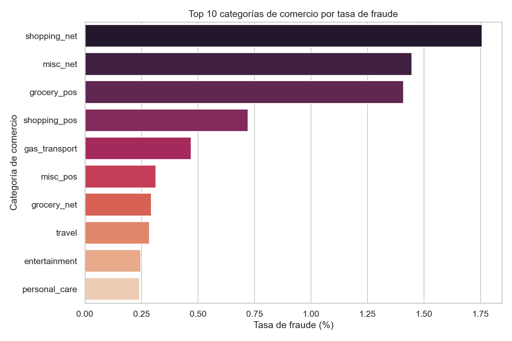

- Categorías de canal "card-not-present" (compras online, `misc_net`, `shopping_net`, etc.)
  muestran tasas de fraude más altas — consistente con el riesgo conocido de canales
  digitales/remotos frente a compras presenciales.

## 5. Mapa de correlación de variables numéricas

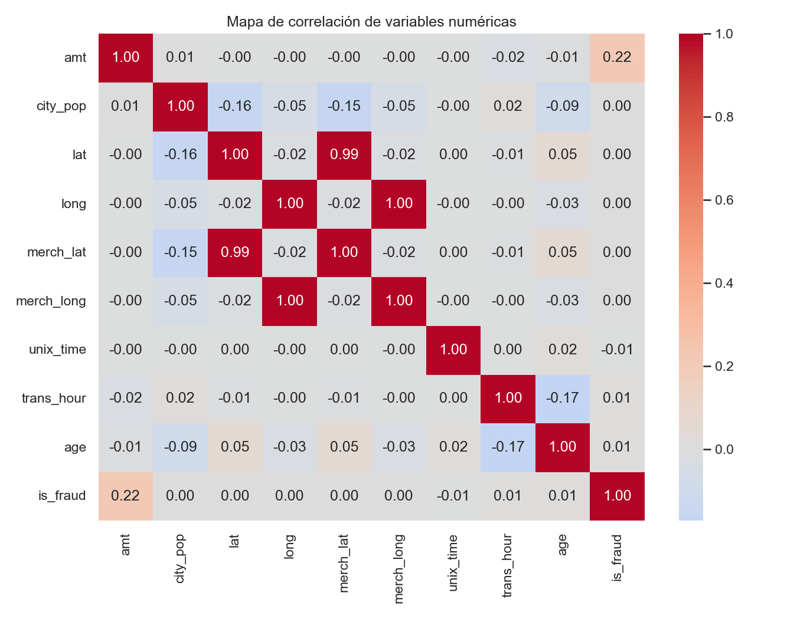

- Las correlaciones lineales individuales con `is_fraud` son **débiles** — `amt` es la
  que más se acerca, pero ninguna variable numérica por sí sola explica el fraude.
- Esto sugiere que la señal de fraude está en **combinaciones/patrones** (monto + hora +
  categoría + comportamiento histórico de la tarjeta), no en una sola variable lineal.
  Un modelo no lineal (árboles, gradient boosting) probablemente capture esto mejor
  que uno lineal.

## 6. Boxplot de monto por clase

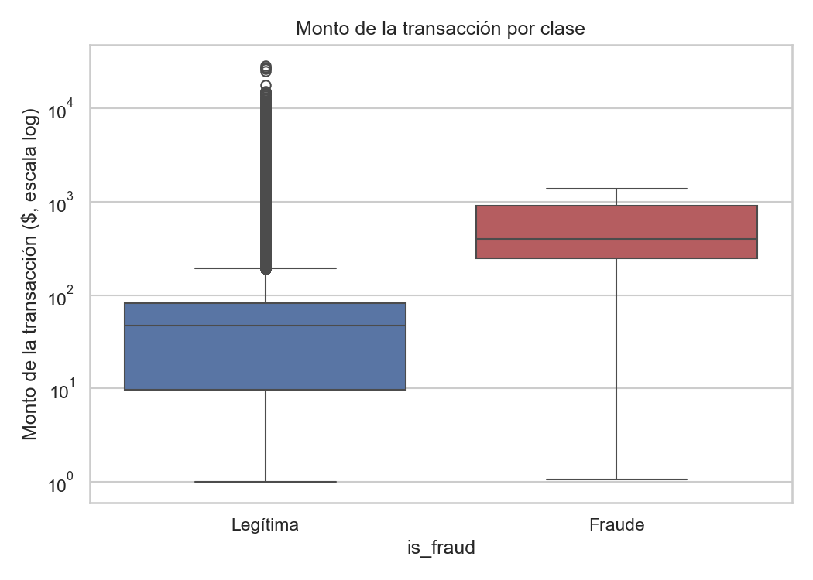

- El fraude tiene una mediana de monto más alta y un rango intercuartílico (IQR) más
  estrecho y desplazado hacia arriba que el de transacciones legítimas — refuerza el
  hallazgo del punto 2.

## 7. Tasa de fraude por categoría (ordenado)

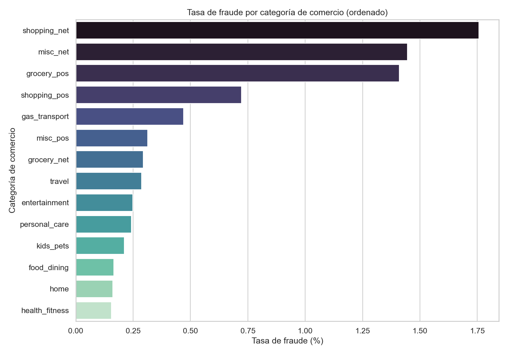

- Hay variación considerable entre las 14 categorías — algunas concentran un riesgo
  de fraude desproporcionado respecto a su volumen. `category` es candidata sólida
  como *feature* (cardinalidad baja: 14 valores → one-hot encoding viable).

## 8. Tasa de fraude por hora del día

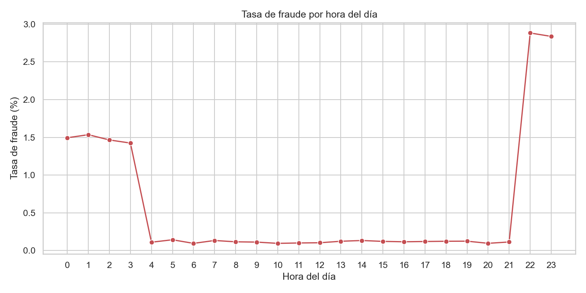

- Pico marcado de tasa de fraude en horas de madrugada — señal temporal fuerte y
  accionable (tanto para *features* de modelo como para reglas simples de filtrado).

## 9. Tasa de fraude por grupo de edad

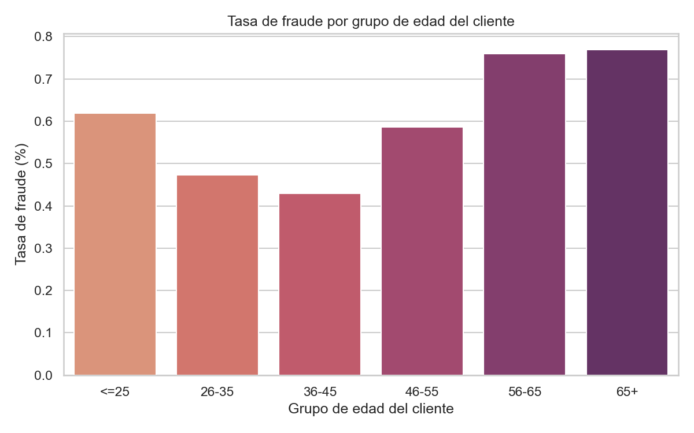

- La tasa de fraude no es uniforme entre grupos de edad; los segmentos de clientes
  de mayor edad tienden a mostrar tasas algo más altas. `age` (derivada de `dob`)
  parece útil como *feature*.

## 10. Tasa de fraude por estado

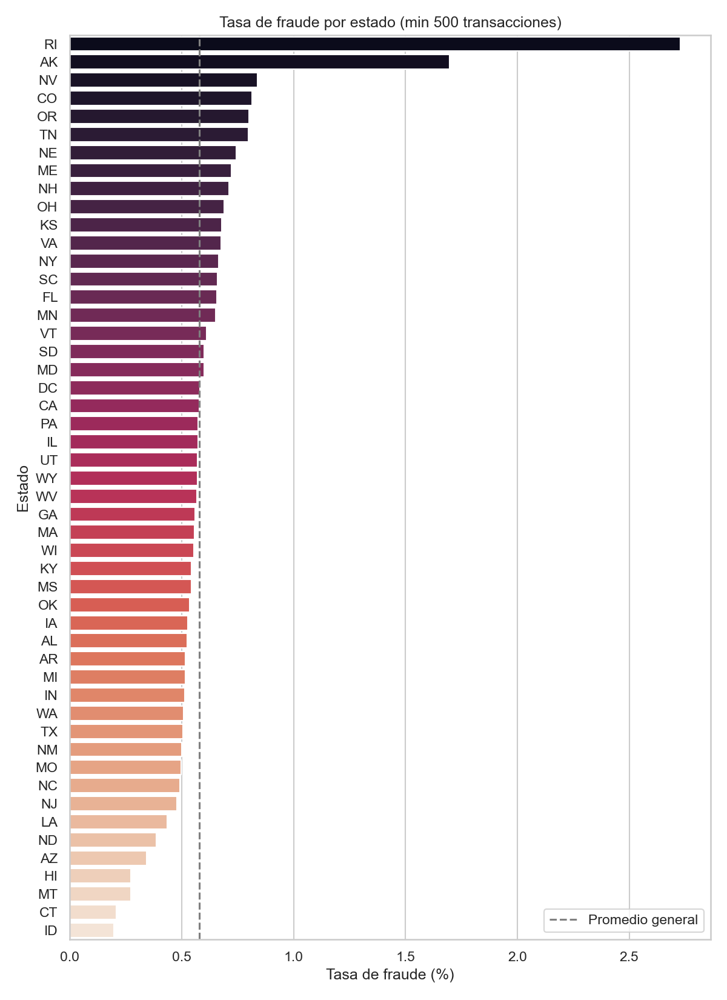

- 51 estados, volumen muy desigual. Estados con pocas transacciones (ej. DE con 9,
  100% fraude) producen tasas extremas **no confiables** — ruido de muestra pequeña
  (por eso el gráfico filtra a ≥500 transacciones).
- Con ese filtro: mayor tasa en RI (2.73%), AK (1.70%), NV (0.84%); menor en
  ID (0.20%), CT (0.21%), MT (0.27%), HI (0.27%).
- La mayoría de estados se agrupa cerca del promedio general (~0.5%–0.7%).

## 11. Estado: volumen de transacciones vs. tasa de fraude

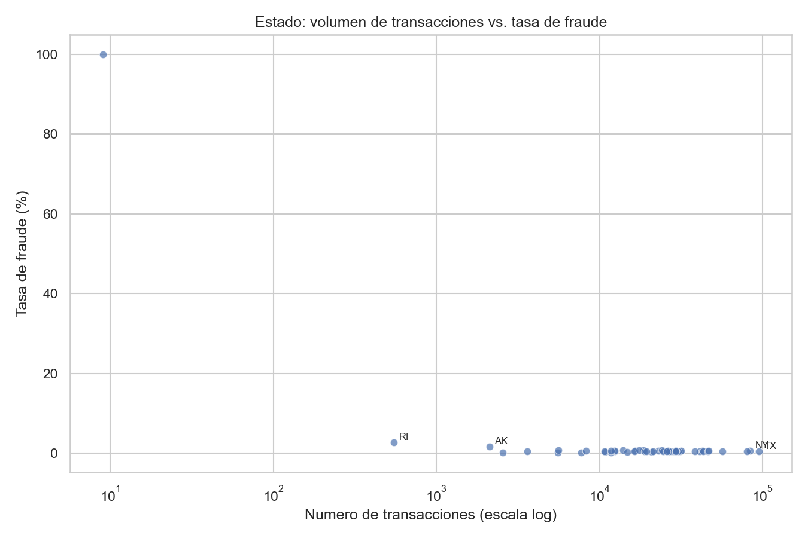

- No hay correlación clara entre volumen y tasa de fraude — los extremos de tasa
  aparecen casi siempre en estados de bajo volumen (artefacto de muestra), mientras
  que los estados de alto volumen (TX, NY, PA, CA...) convergen cerca del promedio.

## 12. Tasa de fraude por tamaño de población de la ciudad (`city_pop`)

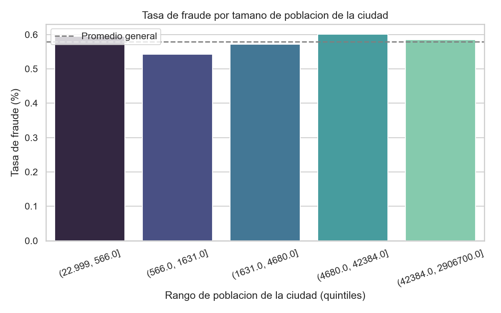

- Dividido en quintiles: la tasa de fraude es prácticamente **plana** (~0.55%–0.60%)
  en los 5 grupos. `city_pop` no aporta señal observable de fraude por sí solo —
  candidata a descartar como *feature* directo.

## 13. Top 15 trabajos (`job`) por tasa de fraude

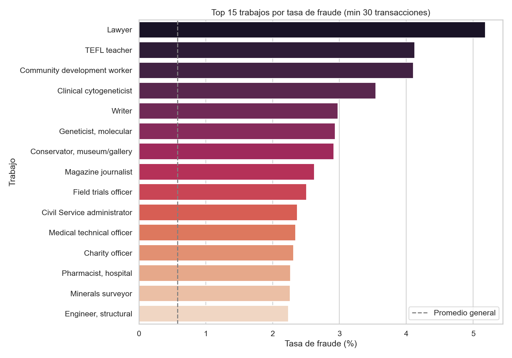

- Con ~494 trabajos distintos y pocas transacciones por trabajo, hay mucho ruido.
  Filtrando a ≥30 transacciones, destacan: Lawyer (5.19%), TEFL teacher (4.13%),
  Community development worker (4.10%) — varias veces el promedio general.
- Tratar como exploratorio: la cardinalidad alta exige un *encoding* que regularice
  (ej. target encoding suavizado o frecuencia), no usar la tasa cruda como feature.

## 14. Trabajo: volumen de transacciones vs. tasa de fraude

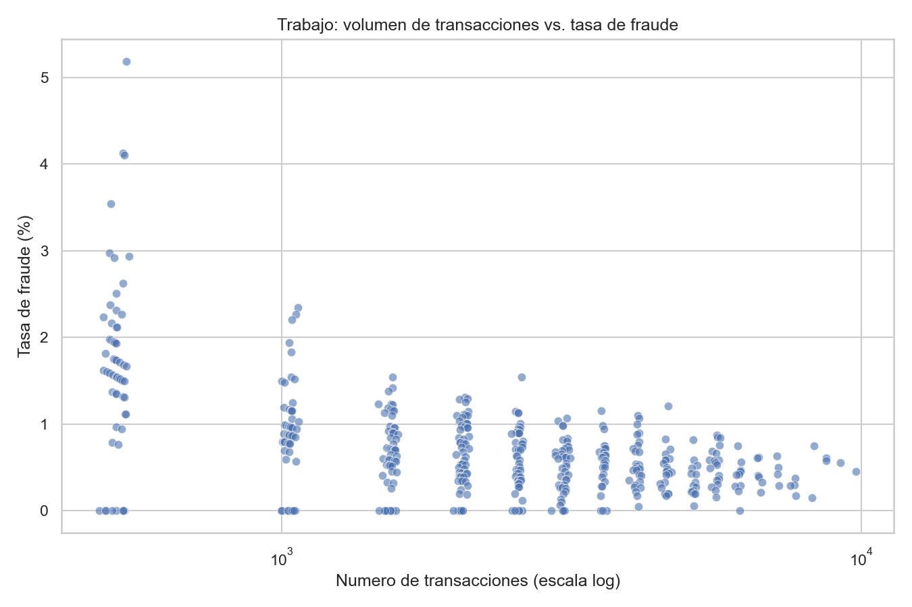

- La mayoría de los trabajos se agrupa cerca de la tasa base (~0.58%); los valores
  atípicos con **alto volumen y alta tasa simultáneamente** son los más relevantes
  para codificar como *feature* — el resto es ruido de muestra pequeña.

## 15. Monto por trabajo (top 8 con mayor tasa de fraude): fraude vs. legítimo

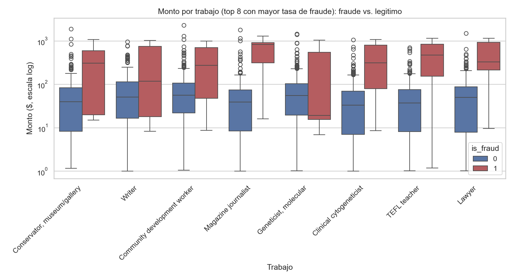

- Incluso dentro de estos trabajos de mayor riesgo, las transacciones fraudulentas
  siguen mostrando montos más altos que las legítimas — el patrón monto-fraude
  (punto 2) se mantiene consistente al cruzar con `job`.

---

## Conclusiones generales y recomendaciones para modelado

1. **Variables más fuertes (señal individual clara):** `amt` (monto), `trans_hour`
   (hora derivada de `trans_date_trans_time`) y `category` — todas muestran diferencias
   marcadas y consistentes entre fraude y no-fraude.
2. **Variables moderadas:** `age` (derivada de `dob`) y `state` muestran algo de
   variación, pero `state` requiere cuidado por el ruido de muestras pequeñas.
3. **Variables débiles / candidatas a descartar:** `city_pop` no muestra relación
   observable con el fraude. Identificadores de alta cardinalidad sin patrón
   generalizable (`cc_num`, `trans_num`, `first`, `last`, `street`) deben excluirse
   del modelo — son ruido/PII, no señal.
4. **`job` y `merchant`** tienen alta cardinalidad (494 y 693 valores) — útiles mas
   requieren *encoding* que regularice (target/frequency encoding), no one-hot directo.
5. **Correlaciones lineales débiles en general** → el fraude depende de combinaciones
   de variables, no de una sola — favorece modelos no lineales (gradient boosting,
   random forest) sobre modelos lineales simples.
6. **Desbalance extremo (0.58% fraude)** → usar métricas apropiadas (PR-AUC, recall,
   precisión) y técnicas de balanceo basadas en peso de clases; evitar *oversampling*
   ingenuo que pueda generar fuga de información en datos con estructura temporal.
7. **Separación entrenamiento/prueba debe ser temporal** (no aleatoria), dado que es
   data de transacciones — un split aleatorio dejaría "ver el futuro" al modelo.
